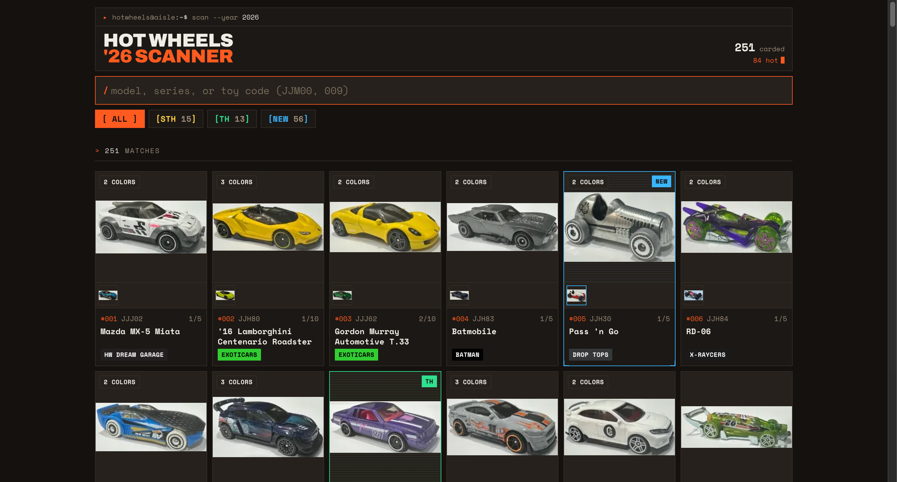
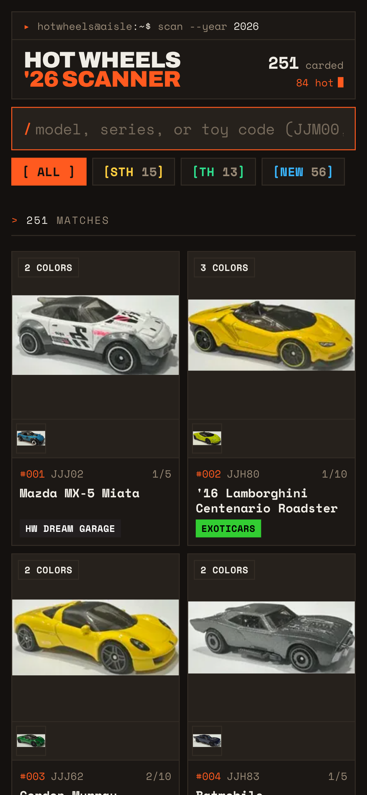

# Hot Wheels Hot-Item Finder 2026

Fast, mobile-first web app to find collectible Hot Wheels while standing in a supermarket
aisle. Type a model name (or scan the thumbnail grid) and instantly see if a car is a
**Treasure Hunt (TH)**, **Super Treasure Hunt (STH)**, or **New Model (NM)**.

Live: https://hot-item-hot-wheels.vercel.app/

Data source: [hotwheels.fandom.com](https://hotwheels.fandom.com/wiki/List_of_2026_Hot_Wheels).

## Features

- **Fuzzy search** across model name, series, and toy # — forgiving of typos in a noisy aisle.
- **Hot-item badges** — instantly flags Treasure Hunt (TH), Super Treasure Hunt (STH), and New Model (NM).
- **One card per collector number** — color variants of the same casting collapse into a single card instead of cluttering the grid.
- **Toy number code** shown on every card for quick cross-referencing against the packaging.
- **Installable PWA** — add to home screen, launches standalone, works offline.
- **Fresh on open** — app shell served NetworkFirst, so a new deploy shows up the next time you open it online.
- **Mobile-first terminal UI** — respects iPhone safe-area insets, built for one-handed scanning.

## Screenshots

| Desktop | Mobile |
| --- | --- |
|  |  |

## Stack

- **Vite + React + TypeScript + Tailwind v4**
- **Fuse.js** — fuzzy search over model name, series, toy #
- **vite-plugin-pwa** (Workbox) — installable, offline-capable, NetworkFirst app shell
- Static SPA, no backend. Catalog baked into `src/data/cars.json` at build time.

## Develop

```bash
npm install
npm run scrape   # (re)build src/data/cars.json from the wiki
npm run dev      # http://localhost:5173
```

## Refresh the catalog

The wiki updates through the year. Re-run the scraper and rebuild:

```bash
npm run scrape
npm run build
```

`scripts/scrape.mjs` hits the MediaWiki API (`action=parse&prop=wikitext`), parses the
two mainline tables, detects `{{TH}}`/`{{STH}}`/`{{NM}}` markers, resolves each photo to
a CDN URL via batched `imageinfo` queries, and writes the JSON.

> The default `fetch` User-Agent gets HTTP 402 from fandom, so the script sends a browser UA.

## Images

Thumbnails are hosted on fandom's CDN, but that CDN **404s any hotlink whose `Referer`
isn't on its allowlist** (our own deploy domain and `localhost` are not). So images are
routed through the free [weserv.nl](https://images.weserv.nl) proxy (`src/lib/img.ts`),
which fetches server-side (no `Referer` problem), caches, and re-encodes to WebP. This
keeps the app fully static with no backend of our own.

## Deploy

Any static host:

```bash
npm run build   # -> dist/
```

Point Vercel / Netlify / GitHub Pages at `dist/`.
